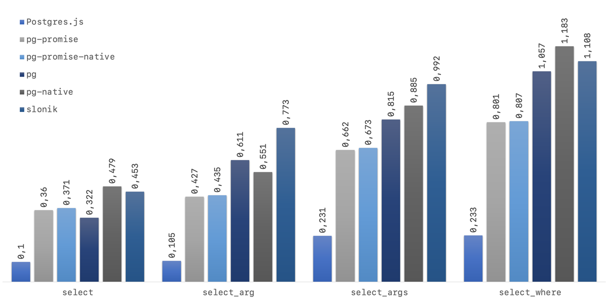

# Postgres Library Benchmarks for Node.js

This is a set of benchmarks focusing on the performance of Postgres client libraries for Node.js. The benchmarks are primarily direct selects of values to measure the input-output performance and not the Performance of postgres data fetching.

> NB. In daily usage it is very likely that this difference doesn't matter as much since the time spent by the client library is negligable compared to the query time itself.

Currently benchmarked libraries are

- [postgres](https://github.com/porsager/postgres)
- [pg-promise](https://github.com/vitaly-t/pg-promise)
- [pg](https://github.com/brianc/node-postgres)
- [pg-native](https://github.com/brianc/node-pg-native)
- [slonik](https://github.com/gajus/slonik)

## Results

These are the results from running the benchmarks on a Macbook Pro 2,9 GHz Quad-Core Intel Core i7 with a default Postgres 12 installation and Node 12.14.0.
The time is the average of 5 rounds, running the queries 10,000 times after some warmup rounds.

client     |         select |     select_arg |    select_args |   select_where
:--------- | -------------: | -------------: | -------------: | -------------:
postgres   |    82ms (5.1x) |    91ms (5.3x) |   226ms (3.6x) |   229ms (5.0x)
pg-promise |   331ms (1.3x) |   368ms (1.3x) |   605ms (1.3x) |   771ms (1.5x)
pg-promise-native |  0.317s (1.3x) |  0.401s (1.2x) |  0.618s (1.3x) |  0.799s (1.4x)
pg         |   292ms (1.4x) |   473ms (1.0x) |   772ms (1.1x) |  1070ms (1.1x)
pg-native  |   419ms (1.0x) |   478ms (1.0x) |   816ms (1.0x) |  1138ms (1.0x)
slonik     | 10466ms (0.0x) | 10904ms (0.0x) | 11190ms (0.0x) | 11107ms (0.0x)


> Slonik is left out of the chart because I'm probably using it wrong and the numbers seem too far off.


> lower is better

## Query descriptions:

#### select

```sql
select 1 as x
```

#### select_arg

```sql
select $1 as x

-- $1 is just 1
```

#### select_args
```sql
select
  $1 as int,
  $2 as string,
  $3 as timestamp,
  $4 as null,
  $5 as boolean,
  $6 as bytea,
  $7 as json

--$1 = 1337
--$2 = 'wat'
--$3 = new Date()
--$4 = null
--$5 = false
--$6 = Buffer.from('awesome')
--$7 = "[{ "some": "json" }, { "array": "object" }]"
```

#### select_where

```sql
select * from pg_catalog.pg_type where typname = $1

--$1 = 'bool'
```

